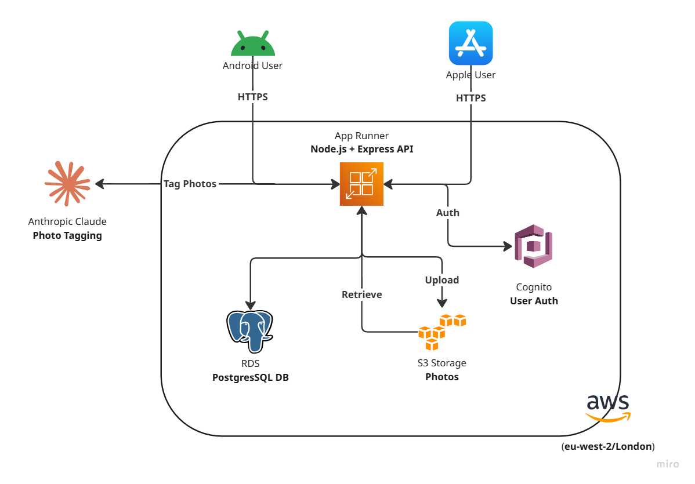

# It's Here Somewhere

<div align="center">
  
</div>

## Stop searching. Start knowing.

---

## The Problem

You're looking for something. You *know* you put it somewhere. You ask your partner where it is. They tidy it away and... forget to tell you. Cue 20 minutes of opening cupboards, checking drawers, and muttering under your breath.

Sound familiar?

**It's Here Somewhere** solves this the only way that works: **shared knowledge**. When you both log what goes where, nobody's guessing. Nobody's searching.

---

## What It Does

- **Log items and locations** - Add what you own and where it lives
- **Take photos** - Snap a picture so you remember what it actually looks like
- **Auto-tagged photos** - AI reads your photos and tags them automatically (no manual labelling)
- **Shared search** - Both of you search from the same source of truth
- **Item history** - See when things moved and who moved them
- **Private items** - Keep personal things to yourself if you need to

---

## Current State (MVP - In Development)

We're building the foundation right now. What you get:

✅ User accounts (secure login via AWS Cognito)  
✅ Photo upload to cloud storage  
✅ AI photo tagging with Claude  
✅ Item logging and categorisation  
✅ Basic search (coming soon)  

---

## Where We're Heading (Full Release)

By November 2026, expect:

- ✨ Location hierarchies (e.g., "Kitchen > Under Sink")
- ✨ Shared household profiles
- ✨ Real-time sync across devices
- ✨ Item condition tracking ("needs mending", "buy more")
- ✨ Household dashboard & statistics
- ✨ Mobile app for iOS and Android
- ✨ Web app for quick lookups

---

## Tech Stack

**Frontend:** React Native + Expo (one codebase, iOS + Android + Web)  
**Backend:** Node.js + Express  
**Database:** PostgreSQL  
**Storage:** AWS S3  
**AI:** Claude API (Anthropic) for photo tagging  
**Auth:** AWS Cognito  
**Cloud:** AWS (RDS, S3, App Runner)  
**IaC:** Terraform  

---

## Getting Started

### For Users

The app isn't public yet - we're still building. Sign up for updates at [link TBC].

### For Developers

Want to contribute or run it locally?

#### Prerequisites
- Node.js (v18+)
- PostgreSQL
- AWS account (for S3, RDS, Cognito)
- Git

#### Setup

1. **Clone the repo**
   ```bash
   git clone https://github.com/paul-create/its-here-somewhere.git
   cd its-here-somewhere
   ```

2. **Install dependencies**
   ```bash
   npm install
   ```

3. **Set up AWS infrastructure**
   ```bash
   cd terraform
   terraform apply -var="db_password=YourSecurePassword"
   cd ..
   ```

4. **Configure environment**
   ```bash
   cp .env.example .env
   # Edit .env with your AWS endpoints and credentials
   ```

5. **Run migrations**
   ```bash
   node run-migration.js
   ```

6. **Start the backend**
   ```bash
   npm start
   ```

The API runs on `http://localhost:3000`.

#### Running the Mobile App (when available)

```bash
cd mobile
npx expo start
```

---

## Architecture Overview
<div align="center">
  
</div>

## Contributing

Not open for public contributions yet, but we'll welcome them soon. Check back after the November release.

---

## Roadmap

| Phase | Status | Est. Completion |
|-------|--------|-----------------|
| **MVP** - Core auth, photo upload, tagging | 🔨 In Progress | Late September 2026 |
| **Backend Complete** - Full item/location/search APIs | 📋 Planned | Early October 2026 |
| **Mobile App** - React Native iOS + Android | 📋 Planned | Mid-October 2026 |
| **Integration & Launch** - Testing, polish, soft launch | 📋 Planned | November 2026 |

---

## Known Limitations (MVP)

- Search is basic (exact match for now - fuzzy search coming)
- No offline mode yet
- Real-time sync uses polling, not WebSockets (efficient but slower)
- Mobile app UI still being designed
- No bulk import from photos yet

---

## License

MIT License - See LICENSE file for details.

---

## Questions?

Reach out to [paul@example.com] or open an issue on GitHub.

---

**Built by Paul Francis** | London, UK | 2026
